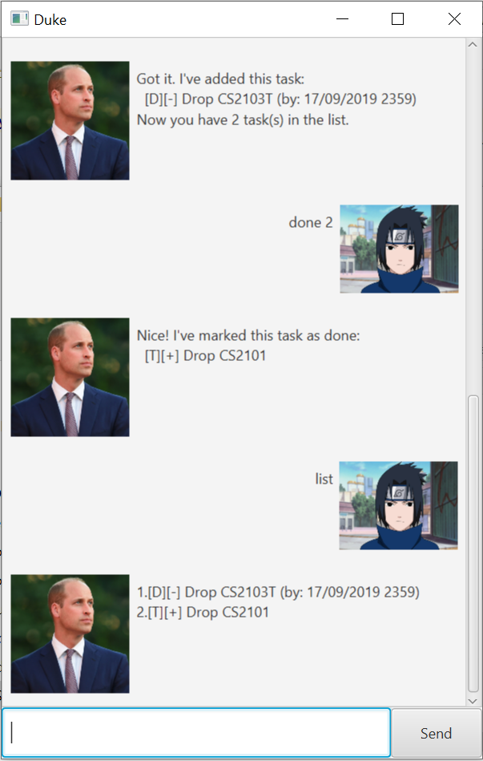

# User Guide



## Features 

### Personalised chatbot
Duke is *your* chatbot. Duke is *Da Duke* to your *Sa Suke*. He does not say much right now but he might do so in a future version!!!

### Task organizer
Duke manages your list of task, allowing you to add, delete, or list whatever todos, deadlines or events. 
What's more, Duke automatically identifies which tasks are more important, sorting them such that the earlier, 
undone tasks show up first. Unfortunately, the GUI currently only supports 5 lines.

## Usage

### `todo` - Add to-do

Add an undone to-do task to the list of tasks.

*General usage:*

`todo <description>`

*Example of usage:*

`todo Drop CS2103T`

*Expected outcome:*
```
Got it. I've added this task:
 [T][-] Drop CS2103T
Now you have 1 task(s) in the list.
```
### `deadline` - Add deadline

Add an undone deadline to the list of tasks.

*General usage:*

`deadline <description> /by <dd/MM/yyyy HHmm>`


*Example of usage:* 

`deadline Drop CS2101 /by 29/09/2019 2359`

*Expected outcome:*
```
Got it. I've added this task:
 [D][-] Drop CS2101 (by: 29/09/2019 2359)
Now you have 2 task(s) in the list.
```

### `event` - Add event

Add an undone event to the list of tasks.

*General usage:*

`deadline <description> /at <dd/MM/yyyy HHmm>`

*Example of usage:*


`deadline Celebrate /at 30/09/2019 0000`

*Expected outcome:*
```
Got it. I've added this task:
 [E][-] Celebrate (at: 30/09/2019 0000)
Now you have 3 task(s) in the list.
```

### `list` - List tasks


List all tasks. Note that tasks are automatically sorted, according to the following rules:

1. Undone tasks are listed first. (highest priority)
1. Dated tasks are listed first.
1. Tasks with an earlier date are listed first.
1. Tasks that are smaller in alphanumerical order are listed first. (lowest priority)

Note that due to the limitation of GUI, only the first 5 lines of tasks are visible, currently.

*General usage:*

`list`

*Expected outcome:*

```
1.[E][-] Celebrate (at: 30/09/2019 0000)
2.[T][-] Celebrate more (at: 01/10/2019 1200)
3.[T][-] Drop CS2103T
3.[D][+] Drop CS2101 (by: 29/09/2019 2359)
```

### `done` - Mark as done

Mark a task as done. Item number of task to be marked as done is as per `list`.

*General usage:*

`done <item number>`

*Example of usage:*

`done 3`

*Expected outcome:*

```
Nice! I've marked this task as done:
  [T][+] Drop CS2103T
```

### `delete` - Delete a task

Delete a task. Item number of task to be marked as done is as per `list`.

*General usage:*

`delete <item number>`

*Example of usage:*

`delete 4`

*Expected outcome:*

```
Noted. I've removed this task:
  [T][+] Drop CS2103T
Now you have 3 task(s) in the list.
```

### `find` - Find tasks containing a keyword

Obtain a list of tasks that contains a (case-insensitive) keyword.

*General usage:*

`find <keyword>`

*Example of usage:*

`find celebrate`

*Expected outcome:*

```
Here are the matching tasks in your list:
1.[E][-] Celebrate (at: 30/09/2019 0000)
2.[T][-] Celebrate more (at: 01/10/2019 1200)
```
